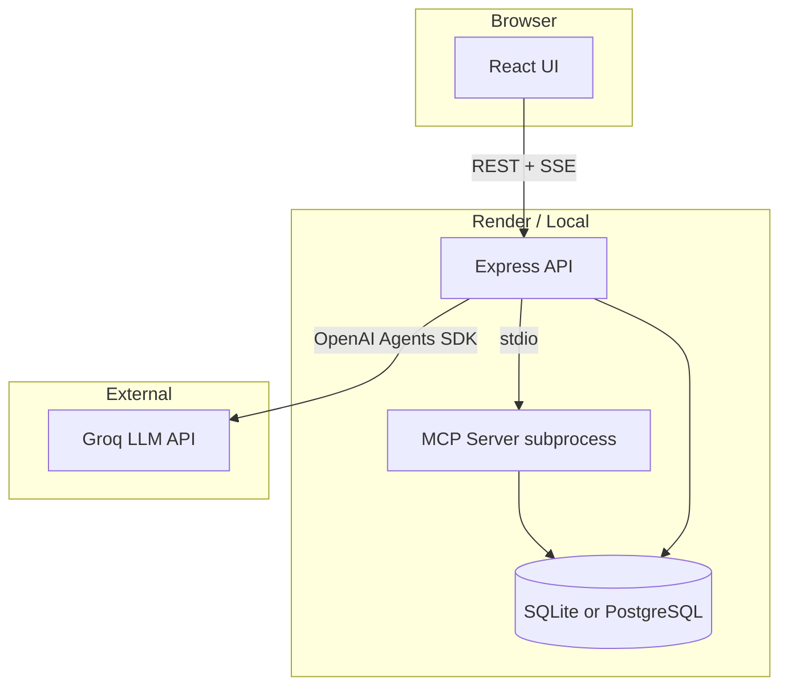

# Architecture

This document describes how the **Order Assistant** full-stack application works.

## High-level overview

## Request flow (chat message)

1. User sends a message in **React** (`apps/web`).
2. **POST `/api/chat`** hits Express (`apps/api`).
3. User message is saved to `chat_messages`.
4. `AgentAppService` runs the agent via **OpenAI Agents SDK**.
5. The agent may call **MCP tools** (subprocess running `src/mcp/server.ts`).
6. MCP tools call **domain services** → **repositories** → **database**.
7. Sensitive tools (`place_order`, `cancel_order`) pause for **human approval**.
8. **SSE** (`/api/events/:sessionId`) streams tool steps and approval events to the UI.
9. Assistant reply is saved to `chat_messages` and returned to the client.

## Production vs learning code

| Path | Role | Used in live app? |
|------|------|-------------------|
| `apps/api/` + `apps/web/` | Full-stack UI + REST API | **Yes** |
| `src/agents-sdk/` | Groq agent + MCP integration | **Yes** |
| `src/mcp/server.ts` | MCP tool server (stdio) | **Yes** |
| `src/services/` + `src/repositories/` | Domain + data access | **Yes** |
| `learning/` | Scratch agent, LangGraph, MCP/Agents SDK demos | No (learning) |

The **production path** is: `apps/web` → `apps/api` → `agents-sdk` → MCP → services → DB.

Learning code imports from `src/` but is excluded from the production TypeScript build (`tsconfig.build.json`).

## MCP tools

| Tool | Approval required | Description |
|------|-------------------|-------------|
| `get_customer` | No | Lookup customer by ID |
| `list_customers` | No | All customers |
| `get_inventory` | No | Stock for a product |
| `list_products` | No | All products + stock |
| `get_order_history` | No | Orders for a customer |
| `get_order` | No | Single order by ID |
| `place_order` | **Yes** | Create order, deduct stock |
| `cancel_order` | **Yes** | Cancel order, restore stock |

Tools are allowlisted in `src/security/ToolSecurityPolicy.ts`.

## Database

| Environment | Engine | Config |
|-------------|--------|--------|
| Local dev | SQLite | `DATABASE_PATH` (default `data/app.db`) |
| Production | PostgreSQL | `DATABASE_URL` on Render |

**Tables:** `customers`, `products`, `inventory`, `orders`, `chat_sessions`, `chat_messages`

Seed data: 40 customers, 40 products (`src/db/seedData.ts`). Run `yarn db:reset` to reload.

## API surface

| Route | Auth | Purpose |
|-------|------|---------|
| `GET /api/health` | Public | Health check |
| `POST /api/chat` | API key + rate limit | Send chat message |
| `GET /api/events/:sessionId` | API key | SSE tool/approval events |
| `POST /api/approval/:id` | API key | Approve/reject tool call |
| `GET /api/orders` | API key | Order history (REST) |
| `GET /api/sessions/:id/messages` | API key | Persisted chat history |

## Security

- **API key** on protected routes (`API_KEY` / `VITE_API_KEY`)
- **CORS** via `WEB_ORIGIN`
- **Rate limiting** on `/api/chat` (`RATE_LIMIT_MAX_REQUESTS` per window)
- **MCP tool allowlist** — only registered tools can run
- **Human approval** for order placement and cancellation

## Deployment (Render)

| Service | Type |
|---------|------|
| `order-assistant-api` | Node web service |
| `order-assistant-web` | Static site |
| `order-assistant-db` | PostgreSQL |

See [README.md](../README.md) for env vars and deploy steps.

## Key design decisions

1. **MCP as subprocess** — tools run isolated; env vars must be forwarded explicitly to the child process.
2. **Repository pattern** — SQLite and Postgres share the same service layer.
3. **SSE for realtime** — tool timeline and approvals without polling.
4. **Session persistence** — chat messages in DB; agent memory still in-process (`MemorySession`) per API instance.
